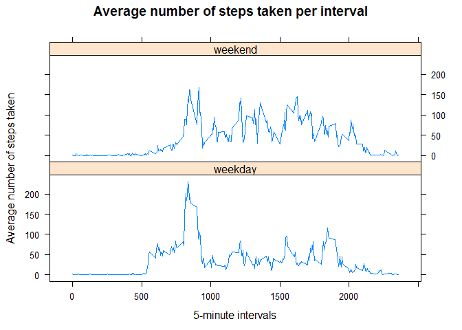

# Reproducible Research: Peer Assessment 1
###by: marozet

### Introduction
This assignment makes use of data from a personal activity monitoring device. This device collects data at 5 minute intervals through out the day. The data consists of two months of data from an anonymous individual collected during the months of October and November, 2012 and include the number of steps taken in 5 minute intervals each day.


### Loading and preprocessing the data
I have used the data provided in the forked GitHub repository. First, I loaded the data from the zipped file. The original file can be found [here](https://d396qusza40orc.cloudfront.net/repdata%2Fdata%2Factivity.zip)

```r
mydata<-read.csv(unz("activity.zip","activity.csv")) #read the csv directly from the zip file
nrow(mydata)
```

```
## [1] 17568
```

Let's look at raw data description:

```r
str(mydata)
```

```
## 'data.frame':	17568 obs. of  3 variables:
##  $ steps   : int  NA NA NA NA NA NA NA NA NA NA ...
##  $ date    : Factor w/ 61 levels "2012-10-01","2012-10-02",..: 1 1 1 1 1 1 1 1 1 1 ...
##  $ interval: int  0 5 10 15 20 25 30 35 40 45 ...
```

'Date' columns is converted into date variable

```r
mydata[,2] <- as.Date(mydata[,2]) #convert into Date
```

Now let's look at preprocessed data:

```r
str(mydata)
```

```
## 'data.frame':	17568 obs. of  3 variables:
##  $ steps   : int  NA NA NA NA NA NA NA NA NA NA ...
##  $ date    : Date, format: "2012-10-01" "2012-10-01" ...
##  $ interval: int  0 5 10 15 20 25 30 35 40 45 ...
```

```r
head(mydata)
```

```
##   steps       date interval
## 1    NA 2012-10-01        0
## 2    NA 2012-10-01        5
## 3    NA 2012-10-01       10
## 4    NA 2012-10-01       15
## 5    NA 2012-10-01       20
## 6    NA 2012-10-01       25
```

```r
summary(mydata)
```

```
##      steps             date               interval     
##  Min.   :  0.00   Min.   :2012-10-01   Min.   :   0.0  
##  1st Qu.:  0.00   1st Qu.:2012-10-16   1st Qu.: 588.8  
##  Median :  0.00   Median :2012-10-31   Median :1177.5  
##  Mean   : 37.38   Mean   :2012-10-31   Mean   :1177.5  
##  3rd Qu.: 12.00   3rd Qu.:2012-11-15   3rd Qu.:1766.2  
##  Max.   :806.00   Max.   :2012-11-30   Max.   :2355.0  
##  NA's   :2304
```


### What is mean total number of steps taken per day?
Let's see a histogram of the total number of steps taken each day. In the next step I calculated the mean and meadian.

```r
stepsByDay <- aggregate(steps~date,mydata[!is.na(mydata$steps),],sum) #calculte aggregation by date
hist(stepsByDay$steps, col="blue", xlab="Number of steps taken", main="Total steps taken each day")
stepsMean <- mean(stepsByDay$steps)
stepsMedian <- median(stepsByDay$steps)
legend("topright",legend=c(paste("mean = ",sprintf(fmt="%.2f",stepsMean)),paste("median = ",stepsMedian)))
```

 

Mean total number of steps taken per day is **10766.188679**  
Median total number of steps taken per day is **10765**


### What is the average daily activity pattern?
Let's see a plot of average daily activity.

```r
stepsByInterval <- aggregate(steps~interval,mydata[!is.na(mydata$steps),],mean) #calculate aggregation by interval
plot(stepsByInterval$interval,stepsByInterval$steps,type="l",main="Average number of steps taken per interval",xlab="5-minute intervals",ylab="Average number of steps taken")
```

 

```r
intervalMax <- stepsByInterval[stepsByInterval$steps== max(stepsByInterval$steps),1]
```

Interval **835** contains the maximum number of steps.


### Imputing missing values

We can see that we have 2304 rows with missing values.

```r
numNA <-sum(is.na(mydata$steps),na.rm=TRUE)
print(numNA)
```

```
## [1] 2304
```
After a quick look at pairs chart it seems that steps~interval relation is much stronger than steps~days, thus using interval for gruping while imputing seems like a better option. 

```r
pairs(mydata,pch=".")
```

 

I imputed missing values with median for a particular 5-minute interval. As we can see we now do not have missing values. I used median, because it is more immune to outliers than mean statistic.

```r
mydataNAImputed <- mydata
library(plyr)
impute.median <- function(x) replace(x, is.na(x), median(x, na.rm = TRUE)) #define function for imputing data
#perform imputing grouped by interval
mydataNAImputed <- ddply(mydataNAImputed, ~ interval, transform, steps = impute.median(steps)) 
summary(mydataNAImputed)
```

```
##      steps          date               interval     
##  Min.   :  0   Min.   :2012-10-01   Min.   :   0.0  
##  1st Qu.:  0   1st Qu.:2012-10-16   1st Qu.: 588.8  
##  Median :  0   Median :2012-10-31   Median :1177.5  
##  Mean   : 33   Mean   :2012-10-31   Mean   :1177.5  
##  3rd Qu.:  8   3rd Qu.:2012-11-15   3rd Qu.:1766.2  
##  Max.   :806   Max.   :2012-11-30   Max.   :2355.0
```

Let's see a histogram of the total number of steps taken each day using imputed data. 

```r
stepsByDay <- aggregate(steps~date,mydataNAImputed,sum) #aggregate new data by date
hist(stepsByDay$steps, col="blue", xlab="Number of steps taken", main="Total steps taken each day")
stepsMean <- mean(stepsByDay$steps)
stepsMedian <- median(stepsByDay$steps)
legend("topright",legend=c(paste("mean = ",sprintf(fmt="%.2f",stepsMean)),paste("median = ",stepsMedian)))
```

 

Mean total number of steps taken per day is **9503.868852**  
Median total number of steps taken per day is **10395**

We can clearly see a difference in results. Not so much in the Median, but a significant change in Mean.

### Are there differences in activity patterns between weekdays and weekends?
First, I created a new factor variable with two levels "weekday" and "weekend".

```r
library(dplyr)
```

```
## 
## Attaching package: 'dplyr'
## 
## The following objects are masked from 'package:plyr':
## 
##     arrange, count, desc, failwith, id, mutate, rename, summarise,
##     summarize
## 
## The following object is masked from 'package:stats':
## 
##     filter
## 
## The following objects are masked from 'package:base':
## 
##     intersect, setdiff, setequal, union
```


```r
# addWeekDay() - function that will choose between "weekday" and "weekend" based on date
addWeekDay <- function(x) {
    if ((weekdays(x)=="Saturday")|(weekdays(x)=="Sunday")) return("weekend")
    else return("weekday")
}
mydataNAImputed$weekday <- sapply(mydataNAImputed$date,addWeekDay) #apply to a new column
mydataNAImputed[,'weekday']<-as.factor(mydataNAImputed[,'weekday']) #convert to factor
str(mydataNAImputed) #check result
```

```
## 'data.frame':	17568 obs. of  4 variables:
##  $ steps   : int  0 0 0 47 0 0 0 0 0 34 ...
##  $ date    : Date, format: "2012-10-01" "2012-10-02" ...
##  $ interval: int  0 0 0 0 0 0 0 0 0 0 ...
##  $ weekday : Factor w/ 2 levels "weekday","weekend": 1 1 1 1 1 2 2 1 1 1 ...
```

Now let's look at the plot containing a time series of the 5-minute interval and the average number of steps taken across all weekday and weekend days.


```r
library(lattice)
stepsByInterval <- aggregate(steps~interval+weekday,mydataNAImputed,mean) #calculate aggregation by interval and weekday
xyplot(steps~interval | weekday, data = stepsByInterval,type="l",main="Average number of steps taken per interval",xlab="5-minute intervals",ylab="Average number of steps taken",layout=c(1,2))
```

 

We can see a clear difference between weekends and weekdays.
